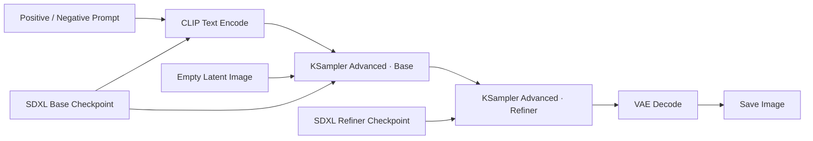

# 02. SDXL Base + Refiner：基础文生图

[返回首页](../README.md)

## 学习目标

理解 SDXL 两阶段生成的基本数据流：Base 负责主要构图和大部分去噪，Refiner 接收中间 Latent 并补充细节，最后由 VAE 解码为可见图像。

可从 [ComfyUI 官方示例站](https://comfyanonymous.github.io/ComfyUI_examples/) 的 [SDXL 示例页](https://comfyanonymous.github.io/ComfyUI_examples/sdxl/) 获取示例。带有 Workflow metadata 的图片通常可以直接拖入 ComfyUI 画布；需要程序调用时，再导出相应的 Workflow/API JSON。

## 核心数据流

## 完整流程展示图

## 核心节点

### Checkpoint Loader

为了使得图片的画质更高，将生成过程分为了两步：Base和R二finder。前者负责构图和勾勒大概的形状，后者负责补充细节和打磨质感。

注释：左紫框为Load Checkponit - BASE，右紫框为Load Checkponit - Refiner

- **Load Checkponit - BASE**：负责理解提示词，提供主要去噪阶段使用的 `MODEL`、文本编码所需的 `CLIP`，并通常提供 `VAE`。
- **Load Checkponit - Refiner**：接收 Base 阶段保留的中间 Latent，在后段采样中补充纹理和细节。

### CLIP Text Encode

注释：左上角的框是Text Prompts文本输入节点，分为positive和negative prompt

- **Positive Prompt**： 描述希望出现的内容。
- **Negative Prompt**： 框定范围的，防止指令崩坏。

右下角的Refiner Prompt与下图中间的Base Prompt，二者的CLIP文本编码器，，分别连接Refiner模型和Base模型的CLIP接口。它们接收左上角Text Prompts的文字，将其转化为模型能懂得特征向量。

### Empty Latent Image

注释：中下的梅紫色框是Empty Latent Image

Empty Latent Image是用来设置Latent图像的宽度，高度和批量大小的。此处的Latent（潜空间）是一种高度压缩的数学表达方式，SDXL是原生在 1024 级别分辨率下训练的，1024 x 1024的图片一般包含上百万的像素点。如果直接将其进行计算处理，显卡可能承受不了如此压力，并且生成速度也会非常缓慢。为此，便有了VAE变分自编码器，它将1024级的像素进行压缩，压缩成128级，但图片的核心特征保持不变。

### KSampler Advanced

注释：图上左右两紫色框是负责核心生成的KSampler（Advanced）节点

靠左的是KSampler Advanced - BASE，从0步开始执行，直到运行到第20步（步数控制均有单独的节点Step Control控制），并允许返回剩余”噪波“。此处引入一个新的概念那就是噪波，噪波就类似电视机上的”雪花点“，而AI绘图的本质就是将雪花点拼凑某种图形。所以说这个允许返回噪波实际上就是留出20%（总步数是25，前者完成20，后者完成5），直接打包给KSampler Advanced - REFINER 进行再细化。此时的Refiner不需要新添加噪点，只需要在原有的基础上进行精修补齐。
。

### VAE Decode

注释：最右边这块橘色节点是图像解码VAE节点

其承担将Latent（潜空间）解码成我们熟知的图片形式（PNG），并且将最终的图片保存。