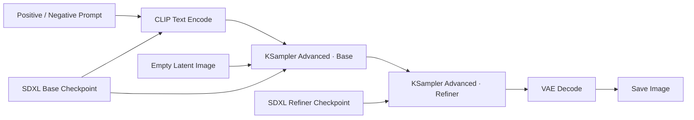

# 02. SDXL Base + Refiner：基础文生图

[返回首页](../README.md)

## 学习目标

理解 SDXL 两阶段生成的基本数据流：Base 负责主要构图和大部分去噪，Refiner 接收中间 Latent 并补充细节，最后由 VAE 解码为可见图像。

可从 [ComfyUI 官方示例站](https://comfyanonymous.github.io/ComfyUI_examples/) 的 [SDXL 示例页](https://comfyanonymous.github.io/ComfyUI_examples/sdxl/) 获取示例。带有 Workflow metadata 的图片通常可以直接拖入 ComfyUI 画布；需要程序调用时，再导出相应的 Workflow/API JSON。

## 核心数据流

## 核心节点

### Checkpoint Loader

- **Base Checkpoint**：提供主要去噪阶段使用的 `MODEL`、文本编码所需的 `CLIP`，并通常提供 `VAE`。
- **Refiner Checkpoint**：接收 Base 阶段保留的中间 Latent，在后段采样中补充纹理和细节。

### CLIP Text Encode

- Positive Prompt 描述希望出现的内容。
- Negative Prompt 描述希望抑制的内容或特征。
- CLIP 将文字转换为模型可使用的条件向量，即 `CONDITIONING`。

### Empty Latent Image

设置生成图像的宽度、高度和批量大小。Latent 是压缩后的特征空间；以 1024 × 1024 图像为例，常见 VAE 的空间压缩倍率为 8，因此对应空间尺寸约为 128 × 128。

### KSampler Advanced

采样器从噪声开始逐步去噪。两阶段 Workflow 会在中间步停止 Base 采样，并把尚未完全去噪的 Latent 交给 Refiner。

原始调研示例采用总计 25 步，其中 Base 完成前 20 步、Refiner 完成后 5 步。这个比例是示例配置，不是固定规则，应结合模型、分辨率和画面目标调试。

### VAE Decode

将最终 Latent 解码为像素图像，再交给预览或保存节点输出 PNG。

## 实验建议

保持 Prompt、Seed、Sampler、CFG 和分辨率不变，只修改 Base/Refiner 的步数分配：

| 实验 | Base 步数 | Refiner 步数 | 观察重点 |
| --- | ---: | ---: | --- |
| A | 25 | 0 | 仅 Base 时的构图与纹理 |
| B | 20 | 5 | 原始笔记中的参考配置 |
| C | 15 | 10 | Refiner 占比提高后的细节与一致性 |

建议记录面部、手部、材质、边缘清晰度、整体构图是否稳定，以及生成耗时和显存占用。

## 完成标准

- 能解释 `MODEL`、`CLIP`、`CONDITIONING`、`LATENT` 和 `VAE` 各自承担的角色；
- 能说清 Base 到 Refiner 传递的是中间 Latent，而不是已经解码的图片；
- 能在固定 Seed 下改变两阶段步数并比较结果。
