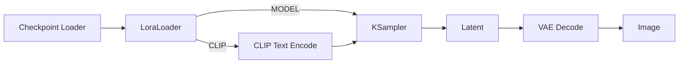

# 03. SDXL + LoRA：风格与人物控制

[返回首页](../README.md)

## LoRA 是什么

LoRA（Low-Rank Adaptation）是一种轻量化的模型适配方式。它通过叠加额外权重，使基础模型具备特定风格、人物或概念的生成倾向，而不需要重新训练完整模型。

## 准备模型

原始调研以像素艺术 SDXL LoRA 为例：

```bash
cd /path/to/ComfyUI/models/loras
wget https://hf-mirror.com/nerijs/pixel-art-xl/resolve/main/pixel-art-xl.safetensors
```

> 该地址是原始笔记采用的镜像链接。下载前请确认权重来源、许可证和适用的基础模型。

## 加载示例

1. 打开 [ComfyUI LoRA 示例页](https://comfyanonymous.github.io/ComfyUI_examples/lora/)。
2. 下载节点较少的单 LoRA 示例，并拖入 ComfyUI 画布。
3. 如果示例引用了缺失的 Checkpoint，在 `Load Checkpoint` 中替换为本机已有且兼容的 SDXL 模型。
4. 在 `LoraLoader` 中选择 `pixel-art-xl.safetensors`。
5. 固定 Prompt 与 Seed，逐组修改 LoRA 强度。

## 数据流



LoraLoader 同时影响两条分支：

- `MODEL` 分支：改变去噪网络的生成倾向，通常更直接地影响视觉风格和形态；
- `CLIP` 分支：改变文本编码侧对相关概念的响应。

## 关键参数

| 参数 | 作用 |
| --- | --- |
| LoRA 名称 | 选择需要加载的 `.safetensors` 文件 |
| `strength_model` | 控制 LoRA 对模型分支的影响强度 |
| `strength_clip` | 控制 LoRA 对文本编码分支的影响强度 |

## 原始对比实验

实验保持 Prompt 和 Seed 不变，同时调整 `strength_model` 与 `strength_clip`：

| 实验 | `strength_model` | `strength_clip` | 观察结果 |
| --- | ---: | ---: | --- |
| A | 0 | 0 | Prompt 仍可驱动像素风，但完成度低：无嘴巴、眼睛模糊 |
| B | 1.0 | 1.0 | 效果最佳：像素风明显、完成度高、结构正常 |
| C | 1.5 | 1.5 | 出现过拟合式崩坏：面部扭曲、人体比例异常 |
| D | 2.0 | 2.0 | 风格接近 1.5，但完成度有所回升；该现象需要更多样本验证 |

## 调研结论

1. **Prompt 与 LoRA 是双重引导。** 即使 LoRA 强度为 0，Prompt 中的 `pixel art style` 仍可能驱动风格，但效果的稳定性与完成度不同。
2. **LoRA 强度并非线性增加质量。** 原始实验中 1.0 表现最佳，超过 1.0 后质量变得不稳定。
3. **经验区间不能替代逐模型测试。** 原始笔记建议从 0.6–1.0 区间试起；不同 LoRA 的最佳权重可能不同。
4. **模型家族必须兼容。** SDXL LoRA 应搭配兼容的 SDXL 基础模型。

## 推荐的改进实验

不要一开始同时修改两个强度。可以先固定 `strength_clip=1.0`，扫描 `strength_model`；再固定最佳 `strength_model`，扫描 `strength_clip`。这样更容易判断问题来自哪个分支。
