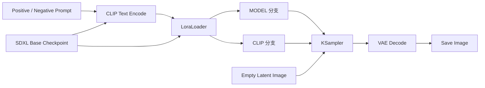

# 03. SDXL + LoRA：风格与人物控制

[返回首页](../README.md)

## 学习目标

理解 LoRA 如何在 Base 模型的去噪网络和文本编码网络中叠加轻量权重，从而在不替换整个模型的前提下，让生成结果偏向特定风格、人物或概念。

可从 [ComfyUI 官方示例站](https://comfyanonymous.github.io/ComfyUI_examples/) 的 [LoRA 示例页](https://comfyanonymous.github.io/ComfyUI_examples/lora/) 获取示例。带有 Workflow metadata 的图片通常可以直接拖入 ComfyUI 画布；需要程序调用时，再导出相应的 Workflow/API JSON。

## 核心数据流



## 完整流程展示图

## 核心节点

### LoraLoader

LoRA 的"安装插槽"。它把轻量权重文件叠加到基础模型上，同时影响去噪网络和文本理解两侧，好比给画家同时换了一套画笔和一副眼镜。

- **MODEL 分支**：改变去噪网络的生成倾向，好比给画家换了一套"像素画笔"，直接影响视觉风格、形态和笔触。
- **CLIP 分支**：改变文本编码侧对相关概念的响应，好比给画家戴了一副"像素风格眼镜"，让他对 Prompt 中的风格词更敏感、理解更到位。
- **强度参数**：`strength_model` 控制画笔浓度，`strength_clip` 控制眼镜度数。两个同时调高容易"乱炖"，建议一次只动一个，先找到最佳搭配。

## 准备模型

原始调研以像素艺术 SDXL LoRA 为例：

```bash
cd /path/to/ComfyUI/models/loras
wget https://hf-mirror.com/nerijs/pixel-art-xl/resolve/main/pixel-art-xl.safetensors
```

## 加载示例

1. 打开 [ComfyUI LoRA 示例页](https://comfyanonymous.github.io/ComfyUI_examples/lora/)。
2. 下载节点较少的单 LoRA 示例，并拖入 ComfyUI 画布。
3. 如果示例引用了缺失的 Checkpoint，在 `Load Checkpoint` 中替换为本机已有且兼容的 SDXL 模型。
4. 在 `LoraLoader` 中选择 `pixel-art-xl.safetensors`。
5. 固定 Prompt 与 Seed，逐组修改 LoRA 强度。

## 关键参数

| 参数 | 作用 |
| --- | --- |
| LoRA 名称 | 选择需要加载的 `.safetensors` 文件 |
| `strength_model` | 控制 LoRA 对模型分支的影响强度 |
| `strength_clip` | 控制 LoRA 对文本编码分支的影响强度 |

## 原始对比实验

实验保持 Prompt 和 Seed 不变，同时调整 `strength_model` 与 `strength_clip`：

| 实验 | `strength_model` | `strength_clip` | 观察结果 |
| --- | ---: | ---: | --- |
| A | 0 | 0 | Prompt 仍可驱动像素风，但完成度低：无嘴巴、眼睛模糊 |
| B | 1.0 | 1.0 | 效果最佳：像素风明显、完成度高、结构正常 |
| C | 1.5 | 1.5 | 出现过拟合式崩坏：面部扭曲、人体比例异常 |
| D | 2.0 | 2.0 | 风格接近 1.5，但完成度有所回升；该现象需要更多样本验证 |

strength_model，strength_clip = 0：


strength_model，strength_clip = 1（初始）：
)

strength_model，strength_clip = 1.5：


strength_model，strength_clip = 2.0:


## 调研结论

1. **Prompt 与 LoRA 是双重引导。** 即使 LoRA 强度为 0，Prompt 中的 `pixel art style` 仍可能驱动风格，但效果的稳定性与完成度不同。
2. **LoRA 强度并非线性增加质量。** 原始实验中 1.0 表现最佳，超过 1.0 后质量变得不稳定。
3. **经验区间不能替代逐模型测试。** 原始笔记建议从 0.6–1.0 区间试起；不同 LoRA 的最佳权重可能不同。
4. **模型家族必须兼容。** SDXL LoRA 应搭配兼容的 SDXL 基础模型。

