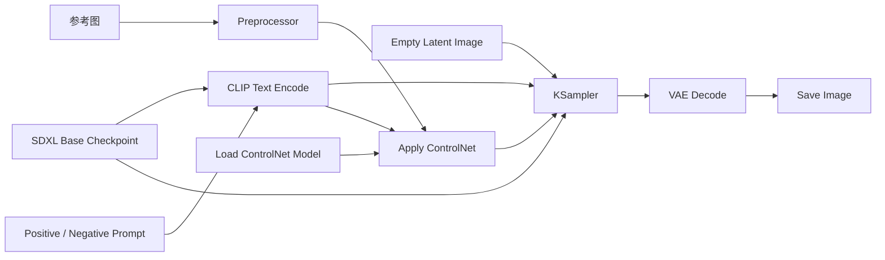

# 04. SDXL + ControlNet：结构控制

[返回首页](../README.md)

## 学习目标

理解 ControlNet 如何在文本条件之外，额外注入姿态、边缘、深度或涂鸦等结构条件，让生成结果"按图施工"而非完全自由发挥。

可从 [ComfyUI 官方示例站](https://comfyanonymous.github.io/ComfyUI_examples/) 的 [ControlNet 示例页](https://comfyanonymous.github.io/ComfyUI_examples/controlnet/) 获取示例。带有 Workflow metadata 的图片通常可以直接拖入 ComfyUI 画布；需要程序调用时，再导出相应的 Workflow/API JSON。

## 核心数据流



## 完整流程展示图

## 核心节点

### Preprocessor

结构翻译器。把普通照片或草图转换成 ControlNet 能读懂的"建筑图纸"。

- 好比把一张真人照片先翻译成"火柴人骨架"或"铅笔线稿"，让 ControlNet 只看结构不看颜色。
- 不同 ControlNet 模型需要匹配对应的预处理器，就像不同监理需要看不同图纸。OpenPose 看骨骼，Canny 看边缘，Scribble 看涂鸦。

### Load ControlNet Model

加载专门训练的结构控制权重，输出一本"结构规范手册"。

- 输出 `CONTROL_NET`。这些模型只懂结构语言，不懂颜色或纹理，专门负责判断"腿应该摆成什么角度"、"轮廓应该遵循什么形状"。

### Apply ControlNet

把结构条件"装订"进文本条件里，形成一份带图纸的施工指令。

- 将 ControlNet、结构图和文本条件组合为新的 `CONDITIONING`。此时 KSampler 拿到的不再是"口头描述"，而是"口头描述 + 建筑图纸"。
- 正向条件中包含了附加的结构约束，模型必须在满足 Prompt 内容的同时，遵守结构图纸的规范。

## 准备模型

原始调研记录了以下 SDXL 模型下载命令：

```bash
cd /path/to/ComfyUI/models/controlnet

# OpenPose：姿态控制
wget https://hf-mirror.com/xinsir/controlnet-openpose-sdxl-1.0/resolve/main/diffusion_pytorch_model.safetensors \
  -O controlnet-openpose-sdxl.safetensors

# Scribble：涂鸦控制
wget https://hf-mirror.com/xinsir/controlnet-scribble-sdxl-1.0/resolve/main/diffusion_pytorch_model.safetensors \
  -O controlnet-scribble-sdxl.safetensors

# Canny：边缘控制（可选）
wget https://hf-mirror.com/xinsir/controlnet-canny-sdxl-1.0/resolve/main/diffusion_pytorch_model.safetensors \
  -O controlnet-canny-sdxl.safetensors
```

## 安装预处理节点

```bash
cd /path/to/ComfyUI/custom_nodes
git clone https://github.com/Fannovel16/comfyui_controlnet_aux.git
cd comfyui_controlnet_aux
pip install -r requirements.txt
```

安装后重启 ComfyUI。可以从 [ControlNet 官方示例页](https://comfyanonymous.github.io/ComfyUI_examples/controlnet/) 选择 Scribble 或 OpenPose 示例开始。

## 预处理器：结构翻译器

预处理器把普通图片或草图转换成 ControlNet 所需的结构表示。模型类型与预处理方式需要匹配。

| 类型 | 输入或预处理结果 | 控制内容 | 典型场景 |
| --- | --- | --- | --- |
| Canny | 黑底白线的边缘图 | 外轮廓与内部结构线 | 保持照片轮廓 |
| OpenPose | 人体骨骼点线图 | 姿态、动作、肢体位置 | 指定人物姿势 |
| Depth | 近白远黑的深度图 | 空间远近与透视 | 控制场景层次 |
| Scribble | 手绘涂鸦或草图 | 大致构图和形状 | 从草稿生成精图 |
| Lineart | 干净线稿 | 线条结构 | 线稿上色 |
| Normal Map | 彩虹色的法线图 | 表面朝向、立体结构 | 控制光影方向、3D 感 |
| MLSD | 直线检测图 | 水平线、垂直线、建筑结构 | 室内设计、建筑、透视严格的场景 |
| Softedge/HED | 柔和的边缘图 | 比 Canny 更模糊的轮廓 | 保留大致形状但允许更多自由发挥 |
| Segmentation | 语义色块分割图 | 物体位置区域 | 指定区域内容 |
| Tile | 原图切分的小块 | 局部细节和结构 | 图像放大（Upscale）时保持细节不崩 |
| Shuffle | 任意参考图 | 风格和色彩分布 | 参考图的风格迁移 |
| Reference | 参考图 | 角色外观/风格一致性 | 让生成图和参考角色长得像 |

以下以Scribble为例子来展示效果：

草图：


完整流程图 + 最终效果图


## 强度调节

- 越接近 `1.0`：越严格遵循参考结构；
- 越接近 `0`：结构约束越弱，生成越自由；
- 原始笔记建议从 `0.8` 开始，再根据构图保持程度逐步调整。
