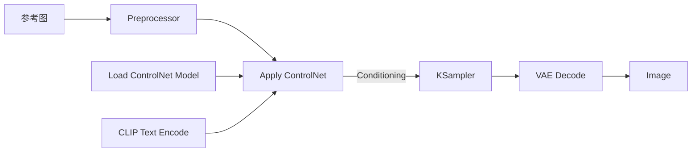

# 04. SDXL + ControlNet：结构控制

[返回首页](../README.md)

## ControlNet 解决什么问题

ControlNet 在文本条件之外增加图像结构条件，使生成结果遵循姿态、边缘、深度、涂鸦或线稿等布局信息。

```text
基础文生图：Text → Image

ControlNet：Text + Pose / Depth / Edge / Scribble → Image
```

## 准备模型

原始调研记录了以下 SDXL 模型下载命令：

```bash
cd /path/to/ComfyUI/models/controlnet

# OpenPose：姿态控制
wget https://hf-mirror.com/xinsir/controlnet-openpose-sdxl-1.0/resolve/main/diffusion_pytorch_model.safetensors \
  -O controlnet-openpose-sdxl.safetensors

# Scribble：涂鸦控制
wget https://hf-mirror.com/xinsir/controlnet-scribble-sdxl-1.0/resolve/main/diffusion_pytorch_model.safetensors \
  -O controlnet-scribble-sdxl.safetensors

# Canny：边缘控制（可选）
wget https://hf-mirror.com/xinsir/controlnet-canny-sdxl-1.0/resolve/main/diffusion_pytorch_model.safetensors \
  -O controlnet-canny-sdxl.safetensors
```

## 安装预处理节点

```bash
cd /path/to/ComfyUI/custom_nodes
git clone https://github.com/Fannovel16/comfyui_controlnet_aux.git
cd comfyui_controlnet_aux
pip install -r requirements.txt
```

安装后重启 ComfyUI。可以从 [ControlNet 官方示例页](https://comfyanonymous.github.io/ComfyUI_examples/controlnet/) 选择 Scribble 或 OpenPose 示例开始。

## 预处理器：结构翻译器

预处理器把普通图片或草图转换成 ControlNet 所需的结构表示。模型类型与预处理方式需要匹配。

| 类型 | 输入或预处理结果 | 控制内容 | 典型场景 |
| --- | --- | --- | --- |
| Canny | 黑底白线的边缘图 | 外轮廓与内部结构线 | 保持照片轮廓 |
| OpenPose | 人体骨骼点线图 | 姿态、动作、肢体位置 | 指定人物姿势 |
| Depth | 近白远黑的深度图 | 空间远近与透视 | 控制场景层次 |
| Scribble | 手绘涂鸦或草图 | 大致构图和形状 | 从草稿生成精图 |
| Lineart | 干净线稿 | 线条结构 | 线稿上色 |
| Segmentation | 语义色块分割图 | 物体位置区域 | 指定区域内容 |

## 数据流



## 核心节点

### Preprocessor

从参考图提取骨骼、边缘、深度、涂鸦或线稿等结构信息。

### Load ControlNet Model

加载与基础模型家族和控制类型匹配的 ControlNet 权重，输出 `CONTROL_NET`。

### Apply ControlNet

把 ControlNet、结构图和文本条件组合为新的 `CONDITIONING`，再交给采样器。此时 KSampler 同时受文本与结构约束。

### KSampler

接收正向条件、负向条件和 Latent 进行采样。加入 ControlNet 后，正向条件中包含了附加的结构约束。

## 强度调节

- 越接近 `1.0`：越严格遵循参考结构；
- 越接近 `0`：结构约束越弱，生成越自由；
- 原始笔记建议从 `0.8` 开始，再根据构图保持程度逐步调整。

## 排查顺序

1. 确认基础模型与 ControlNet 都是 SDXL 对应版本。
2. 确认预处理器类型与 ControlNet 类型一致。
3. 预览预处理结果，先判断结构图是否正确。
4. 固定 Seed，调整 ControlNet 强度。
5. 最后再修改 Prompt、CFG 或采样参数。
