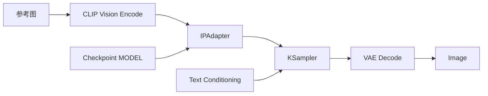

# 05. SDXL + IPAdapter：内容与视觉特征控制

[返回首页](../README.md)

## IPAdapter 解决什么问题

IPAdapter 使用参考图控制人物特征、物体特征或视觉风格。它更接近“画得像这张图”，而 ControlNet 更接近“按这张图的结构画”。

## 准备模型

原始调研记录了以下 SDXL 依赖：

```bash
# IPAdapter 模型
cd /path/to/ComfyUI/models/ipadapter
wget https://hf-mirror.com/h94/IP-Adapter/resolve/main/sdxl_models/ip-adapter_sdxl_vit-h.safetensors

# CLIP Vision 编码器
cd /path/to/ComfyUI/models/clip_vision
wget https://hf-mirror.com/h94/IP-Adapter/resolve/main/models/image_encoder/model.safetensors \
  -O CLIP-ViT-H-14-laion2B-s32B-b79K.safetensors
```

> 节点实现、文件命名和模型目录可能随扩展版本变化。应以实际安装的节点包说明为准。

## 加载与运行

1. 从可信来源获取适用于 SDXL 的 IPAdapter Workflow。
2. 将带 Workflow metadata 的 PNG 拖入画布，或导入 JSON。
3. 在 `Load Image` 节点上传人物照片或风格参考图。
4. 确认 CLIP Vision 与 IPAdapter 权重均已正确加载。
5. 固定 Prompt 和 Seed，逐步调整 IPAdapter 权重。

## 与 ControlNet 的区别

| 维度 | ControlNet（以 Scribble 为例） | IPAdapter |
| --- | --- | --- |
| 控制对象 | 结构、轮廓、姿态 | 内容、人物特征、风格、物体特征 |
| 参考图含义 | “请按这个形状画” | “请画得像这张图” |
| 预处理 | 通常需要对应预处理器 | 原始笔记中的基础流程直接使用参考图 |
| 依赖 | ControlNet 专用模型 | CLIP Vision + IPAdapter 模型 |
| 主要注入位置 | `CONDITIONING` | `MODEL` |

## 数据流



不同扩展版本中的具体节点名称可能不同，但核心链路不变：参考图先被视觉编码，再通过 IPAdapter 把视觉特征注入 `MODEL`。

## 核心组件

### CLIP Vision

负责把参考图像转换为高维视觉特征。它处理的是图像信息，不是 Prompt 文本。

### IPAdapter

接收基础模型、参考图视觉特征以及相应适配器权重，输出经过视觉条件调整的 `MODEL`，供 KSampler 使用。

### Weight

- `0`：不使用参考图影响，接近基础文生图；
- `1.0`：原始笔记中的常规强度参考值；
- 建议先扫描 `0.6–1.0`，再根据人物一致性、构图自由度和风格侵占程度调整。

权重过高可能让参考图特征压过 Prompt，也可能降低画面多样性。

## 关键理解

```text
ControlNet：结构条件 → CONDITIONING → KSampler
IPAdapter：视觉特征 → MODEL → KSampler
```

这条“插入位置”的差异，是区分两者最实用的心智模型。
