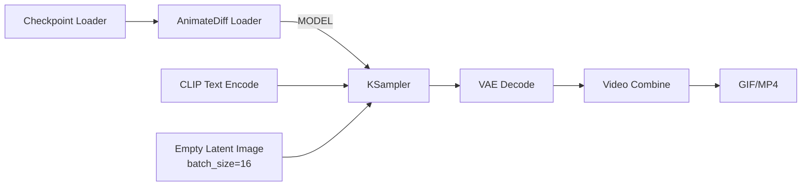

# 07. 视频生成 Workflow（AnimateDiff）

[返回首页](../README.md)

## 一、实验目的

本阶段的目标是理解 ComfyUI 中的视频生成 Workflow 与图像生成 Workflow 的核心区别，并通过 AnimateDiff-Evolved 完成一次基础的视频生成实验。

由于本次实验存在显存/内存限制问题，因此使用 AnimateDiff 节点完成实验。

---

## 二、视频生成核心差异

| 维度 | 图像生成 | 视频生成 |
|---|---|---|
| **Latent** | 2D（高 × 宽） | 3D（帧 × 高 × 宽），增加时间轴 |
| **模型** | UNet | UNet + **时序注意力（Motion Module）** |
| **输出** | 单张 PNG | 帧序列 → Video Combine → GIF/MP4 |
| **显存** | 约 8–10 GB | 约 16–24 GB+ |
| **速度** | 约 10–30 秒/张 | 约 1–5 分钟/段（约 2 秒视频） |

视频生成与图像生成最大的区别，是视频除了空间维度之外还增加了**时间维度**。因此模型不仅需要生成单帧画面，还需要保证相邻帧之间具有一定的连续性。

---

## 三、实验方案：AnimateDiff-Evolved

AnimateDiff 是 ComfyUI 生态中较成熟的视频生成方案。

它并不是简单地在空白 Latent 上独立生成多张图片，而是在图像扩散采样过程中注入 **Motion Module（运动模块）**，使相邻帧的 Latent 在去噪过程中产生时序关联，从而形成连续动作。

可以简单理解为：

```text
普通图像生成：
Prompt → 图像扩散 → 单张图片

AnimateDiff：
Prompt
  ↓
图像扩散
  +
Motion Module
  ↓
多个具有时序关联的帧
  ↓
视频
```

---

## 四、安装 AnimateDiff-Evolved

进入 ComfyUI 自定义节点目录：

```bash
cd /root/ComfyUI/custom_nodes
git clone https://github.com/Kosinkadink/ComfyUI-AnimateDiff-Evolved.git
```

也可以根据实际 ComfyUI 安装路径修改：

```bash
cd /path/to/ComfyUI/custom_nodes
git clone https://github.com/Kosinkadink/ComfyUI-AnimateDiff-Evolved.git
```

---

## 五、准备模型

进入 AnimateDiff 模型目录：

```bash
cd /path/to/ComfyUI/models/animatediff
```

下载运动模块：

```bash
wget https://hf-mirror.com/guoyww/animatediff/resolve/main/mm_sdxl_v10_beta.ckpt
```

> **注意：** AnimateDiff 提供不同模型家族对应的运动模块，例如 SD 1.5 和 SDXL。运动模块需要与基础模型家族匹配。

---

## 六、加载与运行 Workflow

1. 安装 `ComfyUI-AnimateDiff-Evolved`。
2. 重启 ComfyUI。
3. 从官方示例中加载 `txt2vid` Workflow。
4. 在 `AnimateDiff Loader` 中选择运动模块。
5. 设置 `Context Options`。
6. 运行 Workflow，观察生成的帧序列。
7. 最后通过 `Video Combine` 合成为视频文件。

---

## 七、核心数据流

完整workflow




完整逻辑：

```text
Checkpoint Loader
       ↓
AnimateDiff Loader
       ↓
KSampler
       ↑
       ├── CLIP Text Encode
       └── Empty Latent Image
       ↓
VAE Decode
       ↓
Video Combine
       ↓
GIF / MP4
```

### 关键理解

`AnimateDiff Loader` 插在 `Checkpoint Loader` 与 `KSampler` 之间，为模型注入时序注意力能力。

`Empty Latent Image` 的 `batch_size` 在这个视频 Workflow 中可以理解为需要生成的帧数。

最后，`Video Combine` 将生成的帧序列合成为视频。

---

## 八、核心节点

### 1. AnimateDiff Loader

负责加载 Motion Module。

它位于：

```text
Checkpoint Loader
        ↓
AnimateDiff Loader
        ↓
KSampler
```

接收基础模型的 `MODEL`，输出经过 Motion Module 增强后的 `MODEL`。

可以理解为：

> 给普通的图像生成模型增加“时间感知能力”。

关键参数：

- `model_name`：选择 Motion Module 文件，例如 `mm_sd_v14.ckpt`、`mm_sdxl_v10_beta.ckpt`
- `beta_schedule`：调度器类型
  - SDXL：`linear (AnimateDiff-SDXL)`
  - SD 1.5：通常使用 `sqrt_linear`

---

### 2. Context Options

视频不能总是一次性处理全部帧，因此 AnimateDiff 会使用滑动窗口机制。

主要参数：

- `context_length`：每个窗口处理多少帧，通常为 16
- `context_overlap`：相邻窗口重叠多少帧，通常为 4

例如 49 帧的视频可以被拆成多个 16 帧窗口，并让相邻窗口重叠 4 帧，以改善窗口衔接处的连续性。

---

### 3. Empty Latent Image

图像生成中：

```text
batch_size = 一次生成多少张图
```

而在本次视频 Workflow 中：

```text
batch_size = 生成多少帧
```

本次实验设置：

```text
batch_size = 16
```

因此生成的是一个短视频帧序列。

---

### 4. KSampler

KSampler 执行去噪采样。

与普通图像生成相比，此时 KSampler 接收到的 `MODEL` 已经经过 Motion Module 增强。

因此每一帧的去噪过程不再完全独立，而是通过 Motion Module 的时序注意力与前后帧产生关联。

这也是 AnimateDiff 能够产生连续动作的关键。

---

### 5. Video Combine

负责将 VAE Decode 输出的帧序列合成为最终视频。

主要参数：

- `frame_rate`：帧率，例如 8 fps
- `format`：输出格式，例如 `image/gif` 或 `video/h264-mp4`
- `loop_count`：循环次数

### 踩坑记录

本次实验使用 `image/gif` 时曾出现：

```text
invalid palette size
```

之后改为：

```text
video/h264-mp4
```

并成功输出视频。

因此调研阶段更推荐使用 MP4（H.264）作为输出格式。

## 十、实验结果

| 项目 | 状态 |
|---|---|
| 链路跑通 |  从 Prompt 到 Video Combine 成功输出 MP4 |
| 时序连贯性 |  有基本帧间关联，但动作幅度极小 |
| 画面质量 |  出现明显色块、模糊、面部崩坏 |
| 整体可用性 |  当前参数下不满足可用标准 |

---

## 十一、问题分析

### 1. 模型家族不匹配

本次实验使用的 Checkpoint 是 `cardosAnime_v20`（动漫风格 SD 1.5 模型），而 Motion Module 与 VAE 之间的兼容性未经严格验证。

不同模型家族或组件混用可能造成：

- 色块
- 颜色偏移
- 画面异常
- 解码问题

因此视频生成对模型组件的一致性要求更高。

---

### 2. Steps 不足

本次：

```text
Steps = 20
```

对于复杂 Prompt 可能不足。

后续可以尝试：

```text
Steps = 30–50
```

观察画面质量和收敛情况。

---

### 3. FreeNoise 设置干扰

实验中的 Sample Settings 启用了 `FreeNoise`。

在部分情况下，它可能引入额外噪声，影响画面稳定性。

后续可以关闭 FreeNoise 进行对比。

---

### 4. 分辨率与模型训练域不匹配

本次使用：

```text
512 × 512
```

但对于当前 Checkpoint 不一定是最优分辨率。

在显存允许的情况下，可以进一步测试更高分辨率。


## 十二、调研结论

1. AnimateDiff 的核心是 **Motion Module 的时序注入**。它不改变基础模型的权重，而是在采样阶段通过注意力机制约束帧间 Latent 的关联性。
2. 视频生成的 Latent 可以理解为增加了时间维度。相比图像的 `(h, w)`，视频进一步包含 `(t, h, w)`。
3. 视频生成通常需要通过 Context Options 等机制分块处理，以降低显存压力。
4. 模型家族一致性比普通图像生成更加重要。Motion Module、Checkpoint、VAE 等组件不匹配可能直接造成视频画面崩坏
